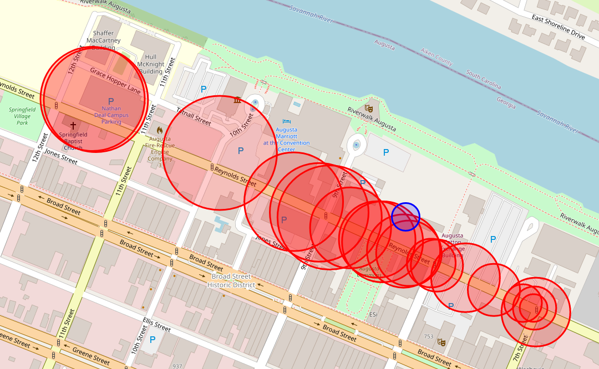

# kismet
Collection of Scripts to be used with Kismet

## Trilateration.py 

This python script can provide a rough location of a Wi-Fi Access Point by trilaterating the signal using kismet historical goepoints and the rssi values associated with them. 

usage: 
```
python3 trilateration.py -f /path/to/file.kismet -t AA:BB:CC:DD:EE:FF
```

The output from this script is a folium map that displays all historical geopoints as red circles, the radius of which is determined by the rssi value measured at that point. It also displays the (roughly) calculated location as a blue circle. See the example below:


